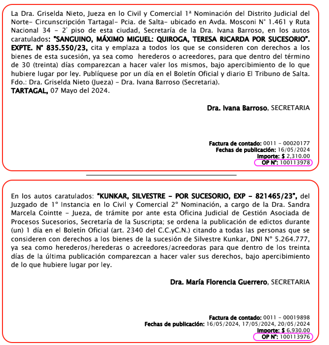
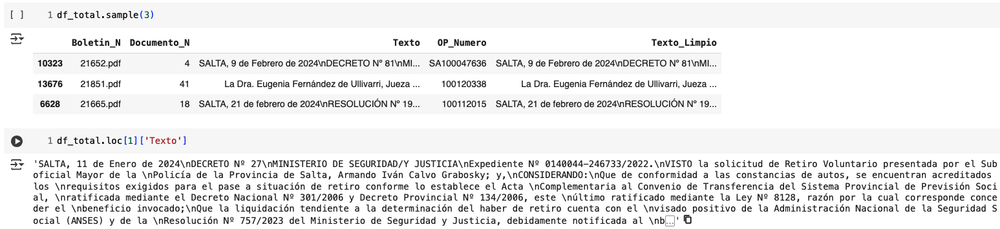
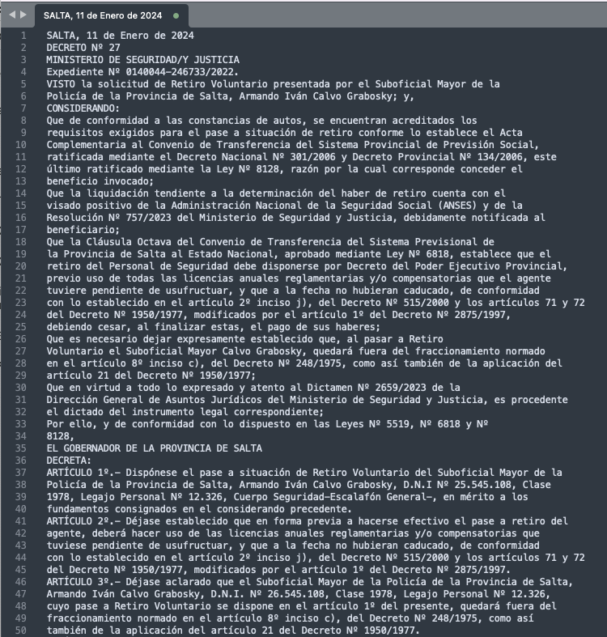
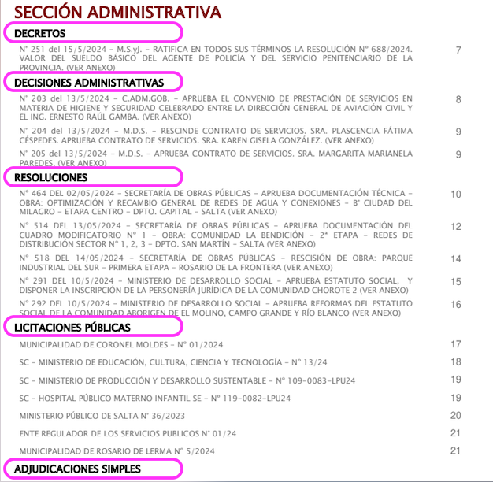
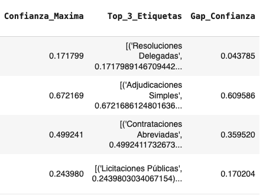
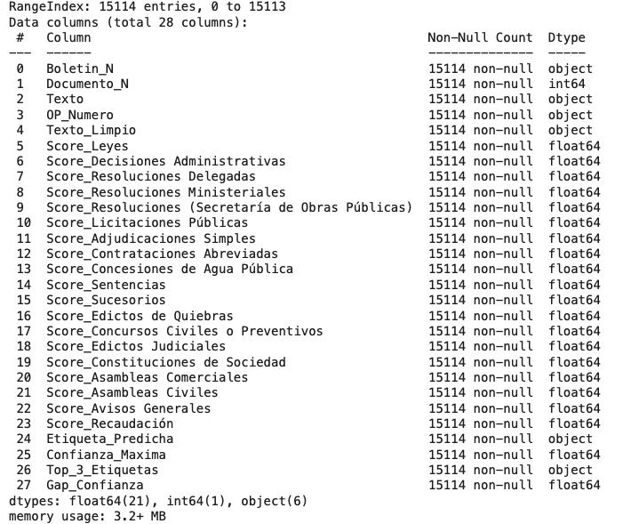
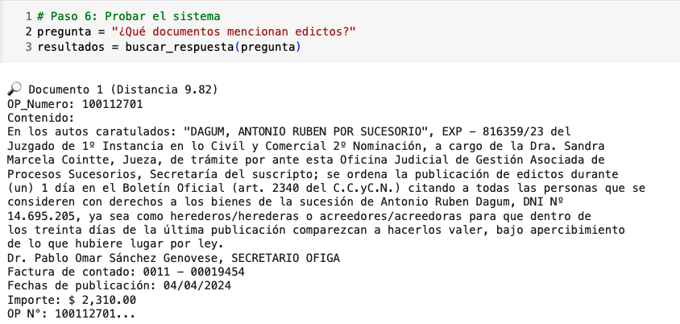
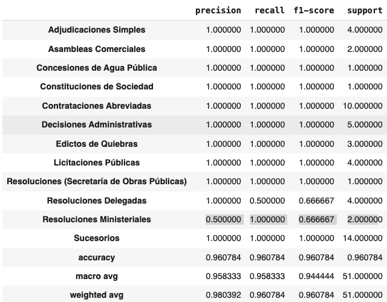
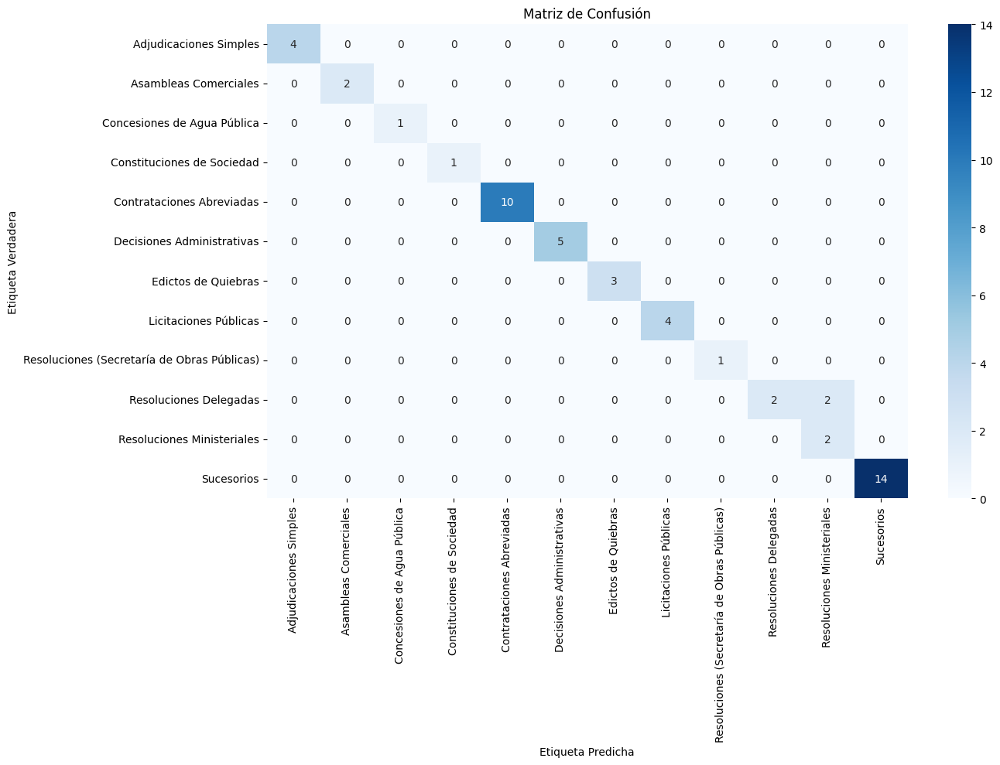

# README - Clasificación Automática de Documentos del Boletín Oficial

## 🗂️ Descripción General
Este proyecto aborda un desafío de Procesamiento de Lenguaje Natural (NLP) aplicado a documentos administrativos del Estado. Su objetivo es automatizar la clasificación temática de documentos publicados en boletines oficiales, permitiendo una búsqueda más eficiente y una comprensión semántica de grandes volúmenes de texto. 


Para lograrlo, se integran técnicas modernas de NLP con arquitecturas preentrenadas, embebido semántico y modelos de inferencia `zero-shot`.

El pipeline completo abarca desde la descarga de boletines oficiales hasta su clasificación automática y posterior búsqueda semántica a través de preguntas en lenguaje natural.

---

## 📁 Estructura del Proyecto
```
project_root/
│
├── boletines.zip                  # Archivo original descargado desde Google Drive
├── boletines_extraidos/          # Carpeta donde se extraen los PDFs
│   └── Boletines/
│       └── boletines_2024/       # Contiene todos los PDFs individuales
├── classification_checkpoint_*.pkl # Checkpoints periódicos durante la clasificación
├── resumen.csv                   # Archivo CSV con los resultados finales
└── Austral_Entrega_Final_NLP_Boletines.ipynb # Notebook principal
```

---

## 🔁 Diagrama de Flujo del Proceso

```
graph TD
    A[Inicio] --> B[Descarga de PDF desde Drive]
    B --> C[Extracción de documentos con expresiones regulares]
    C --> D[Limpieza del texto (pies de página, encabezados)]
    D --> E[Creación de DataFrame consolidado]
    E --> F[Clasificación con modelo Zero-Shot]
    F --> G[Análisis y resumen de etiquetas]
    F --> H[Checkpoint y guardado]
    E --> I[Embeddings con SentenceTransformer]
    I --> J[Índice FAISS para búsqueda]
    J --> K[Búsqueda semántica por similitud textual]
```

---

## 🤖 Componentes de NLP y su Operación

### 1. Preprocesamiento de Documentos
Se descargan PDFs desde un enlace de Google Drive, se extrae su texto ignorando las primeras páginas (índices) y se segmenta cada boletín en documentos individuales. La segmentación se realiza utilizando expresiones regulares que detectan patrones como `OP Nº: XXXXXXX`, característicos de los boletines oficiales.






Posteriormente se eliminan encabezados y pies de página que interfieren en el análisis semántico.



### 2. Modelos de Clasificación Zero-Shot
Utilizamos el modelo `facebook/bart-large-mnli`, entrenado en tareas de inferencia textual (NLI), que permite aplicar una técnica denominada **zero-shot learning**. En lugar de requerir datos etiquetados para entrenamiento, el modelo puede inferir a qué categoría pertenece un texto usando hipótesis semánticas del tipo:

> "Este documento trata sobre licitaciones públicas."

Se compara la probabilidad de esta hipótesis para múltiples etiquetas candidatas.



### 3. Clasificador Optimizado
Se implementa una clase `DocumentClassifierOptimized` que permite:
- Preprocesamiento por lotes.
- Clasificación eficiente con reducción de memoria.
- Checkpoints periódicos para no perder el progreso.

Este enfoque resulta fundamental cuando se trabaja con más de 15.000 documentos y se requiere procesamiento en GPU con eficiencia.

Finalmente se logra la prediccion del score de las etiquetas candidatas y se selecciona la etiqueta con mejor score.


### 4. Búsqueda Semántica por Pregunta
Se integra un sistema de recuperación de información basado en embeddings semánticos:
- Se usa `SentenceTransformer` para representar cada documento como un vector en un espacio semántico.
- Se indexan estos vectores con `FAISS` para realizar consultas rápidas por distancia coseno o L2.
- Se ingresa una pregunta en lenguaje natural (ej: "¿Qué documentos mencionan adjudicaciones?") y el sistema devuelve los documentos más relevantes.

Este componente transforma una búsqueda tradicional en una búsqueda inteligente, capaz de encontrar documentos aun cuando no contienen literalmente las palabras de la pregunta.

---

## 🧠 ¿Qué es Zero-Shot Learning y por qué es útil?
Zero-shot learning permite clasificar texto sin necesidad de entrenamiento adicional. Funciona mediante la evaluación de la relación semántica entre el texto de entrada y una lista de hipótesis etiquetadas. En nuestro caso, las hipótesis fueron diseñadas en español para reflejar categorías típicas de los boletines oficiales:

- "Este documento trata sobre leyes."
- "Este documento trata sobre resoluciones ministeriales."

La ventaja de este enfoque es que no se requiere un dataset previamente etiquetado. Se puede aplicar a nuevos dominios (como documentos administrativos) sin necesidad de fine-tuning.

---

## 📊 Etiquetas Utilizadas
Las 19 etiquetas semánticas definidas incluyen:
- Leyes
- Decisiones Administrativas
- Resoluciones Ministeriales
- Licitaciones Públicas
- Contrataciones Abreviadas
- Sentencias
- Edictos Judiciales
- Recaudación
- etc.

Estas categorías permiten una clasificación temática detallada y útil para tareas legales, administrativas y de transparencia.

---

## 🌐 Tecnologías Usadas
- **Python 3.11**
- **Hugging Face Transformers**
- **PyMuPDF (fitz)** para extracción de texto de PDF
- **pandas**, **numpy**, **tqdm** para manipulación y visualización
- **sentence-transformers** para embeddings
- **FAISS** para búsqueda eficiente
- **Google Colab** para entrenamiento en GPU

---

## 📜 Ejemplo de Uso
```python
pregunta = "¿Qué documentos mencionan edictos?"
resultados, indices = buscar_respuesta(pregunta)
```
Esto devuelve los documentos que, semánticamente, se relacionan con adjudicaciones, aunque no contengan la palabra literal.


---

## 🚀 Resultados
- Se procesaron **+15.000 documentos** extraídos desde PDFs del boletín oficial.
- Se clasificaron en **19 categorías** sin entrenamiento supervisado.
- Se generó un sistema de búsqueda inteligente capaz de responder preguntas.
- Se logró un pipeline automatizado, reproducible y escalable para tareas administrativas y legales.

---

## 📄 Autor
Trabajo final de la materia **Text Mining**, Universidad Austral.

**Alberto Tejerina**
**Cristian Salinas**

---

## 🔧 Mejoras Futuras
- Entrenamiento supervisado con dataset etiquetado para aumentar la precisión.
- Incorporación de OCR para textos escaneados (no seleccionables).
- Interfaz web de usuario para exploración interactiva.
- Exportación de resultados a bases de datos relacionales o APIs REST.

---

## ✅ Evaluación del Modelo de Clasificación (Muestra Manual)

Se evaluó el rendimiento del modelo sobre una muestra aleatoria de 68 documentos del Boletín Oficial, los cuales fueron etiquetados manualmente. Para garantizar una evaluación justa, se eliminaron del análisis aquellas **etiquetas verdaderas que el modelo nunca predijo**, ya que no formaban parte de las categorías previstas.

### ❌ Etiquetas verdaderas no evaluables (no disponibles en el modelo)

```
ASAMBLEAS CIVILES
Avisos Comerciales
Avisos Generales
CONVOCATORIAS A AUDIENCIA PÚBLICA
DECRETOS
Decretos
EDICTOS DE MINAS
NOTIFICACIONES ADMINISTRATIVAS
POSESIONES VEINTEAÑALES
REMATES JUDICIALES
```

Estas categorías fueron eliminadas del cálculo de métricas para no afectar negativamente al modelo con clases que no estaba diseñado para reconocer.

---

### 📊 Métricas de Desempeño

Luego del filtrado, el modelo alcanzó una **accuracy global de 96.1%**, con los siguientes resultados por clase:

```python
from sklearn.metrics import classification_report
print(classification_report(y_true, y_pred))
```


> 📌 Podés consultar el DataFrame `df_reporte` para ver la tabla completa en el notebook.

---

### 🧮 Matriz de Confusión

La siguiente matriz permite visualizar los aciertos (diagonal) y los errores de predicción (fuera de la diagonal):

```python
from sklearn.metrics import confusion_matrix
sns.heatmap(cm, annot=True, fmt='d', cmap='Blues')
```

---

### 📌 Conclusión

- El modelo demostró **alto rendimiento general** y buena capacidad de generalización, especialmente considerando que se trata de un sistema `zero-shot`.
- Las confusiones más frecuentes se observaron entre etiquetas conceptualmente similares, como:
  - *Resoluciones Delegadas* ↔ *Resoluciones Ministeriales*
  - *Sentencias* ↔ *Edictos de Minas* (ambos tipos judiciales)
- La performance sugiere que el modelo es adecuado para tareas de clasificación inicial y búsqueda inteligente en documentos administrativos.
